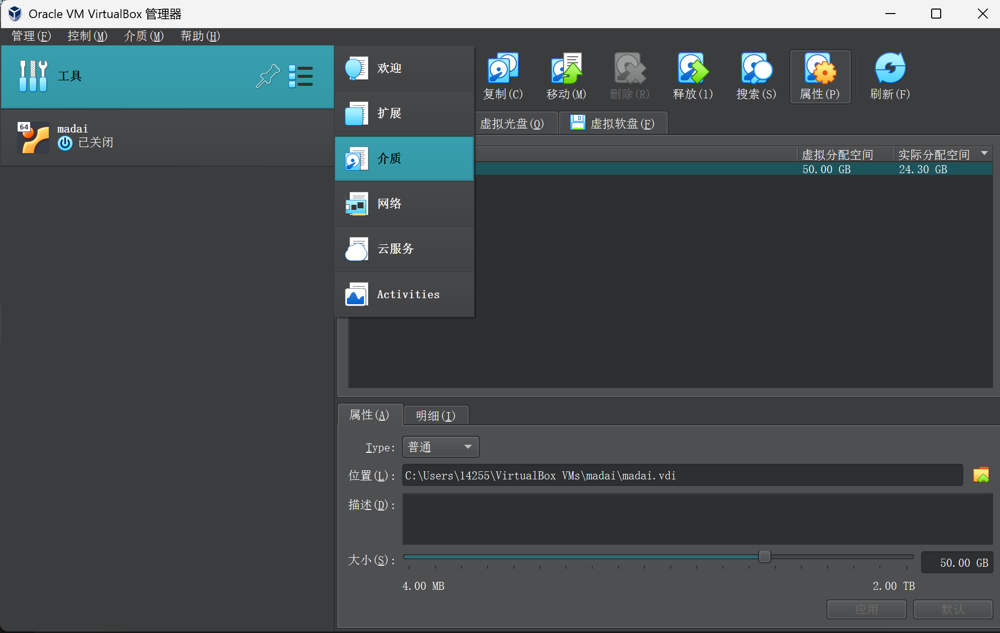
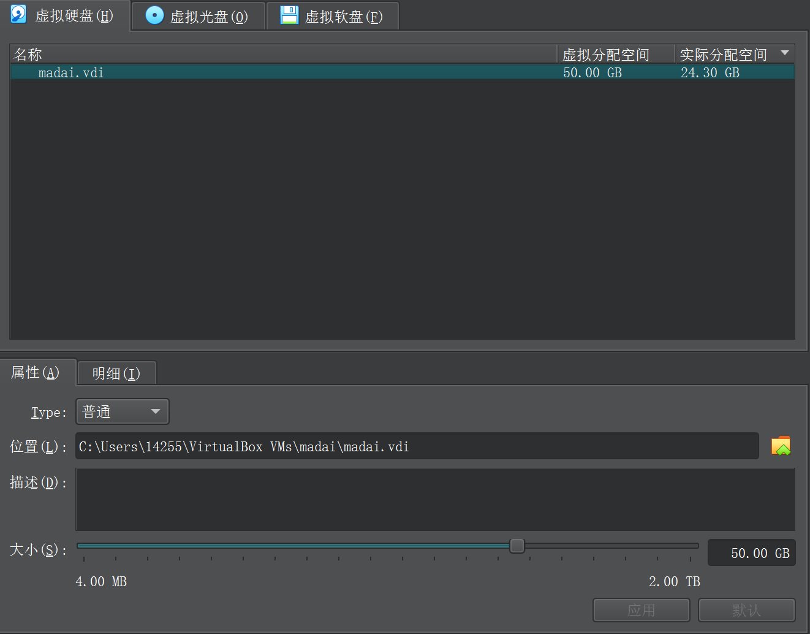
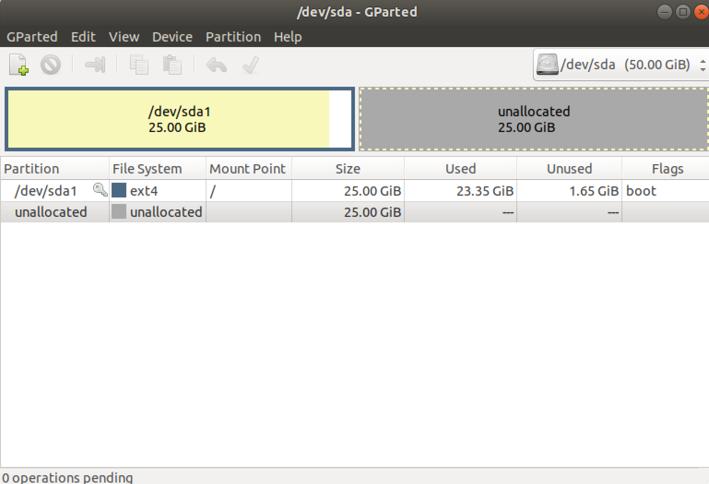
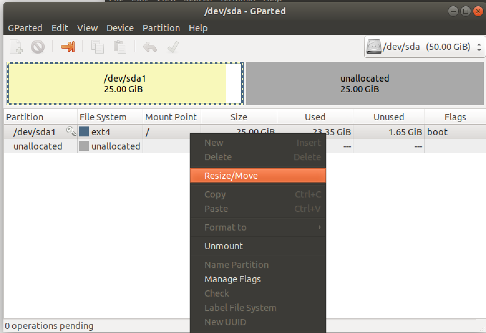
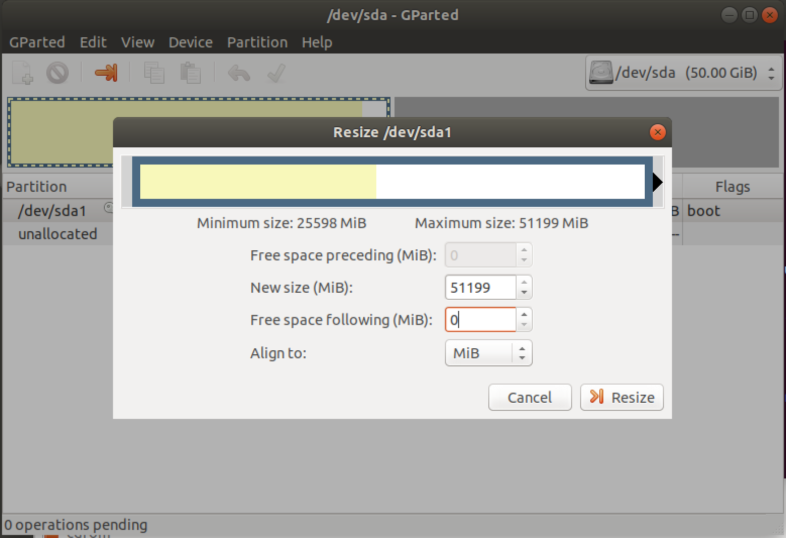
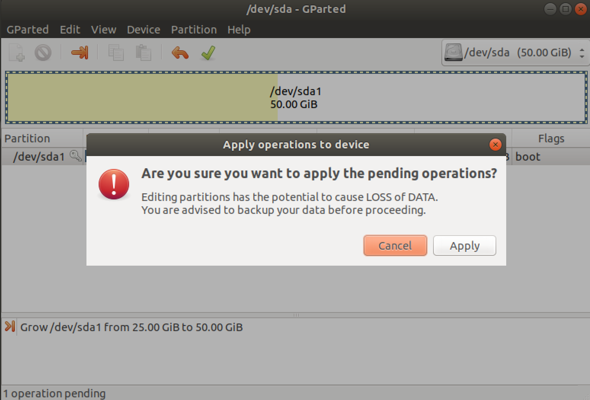
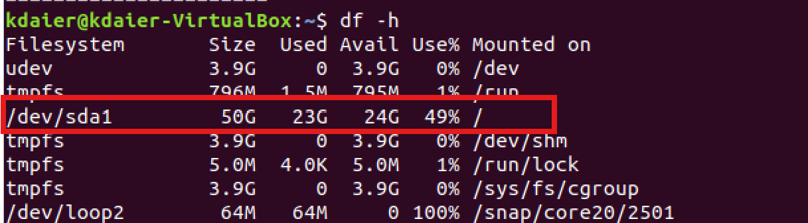

扩展 VirtualBox 中 Ubuntu 18.04 虚拟机磁盘空间主要分两步：

---

## 📌 第 1 步：扩展 VirtualBox 虚拟磁盘文件

如果你虚拟机的磁盘是 `VDI` 或 `VHD` 格式，可以直接扩容。

### 🎯 操作方法：

1. **关掉虚拟机**
   （必须是完全关机状态，不能是挂起）
2. **执行磁盘扩容**




   比如把原来的 25GB 扩展到 50GB：

---

## 📌 第 2 步：在 Ubuntu 里扩展分区

磁盘文件扩好了，系统里原来的分区并不会自动扩展，要手动分区。

### 🎯 操作方法：

1. 启动虚拟机
2. 安装 `gparted`（图形化分区工具）

```bash
sudo apt update
sudo apt install gparted
```

3. 打开 `gparted`

```bash
sudo gparted
```

4. 找到你要扩容的磁盘（通常是 `/dev/sda`）
5. 右键你的 ext4 主分区，**Resize/Move**



6. 把后面未分配的空间分配给主分区




7. 点击 `Apply` 应用改动



8. 重启虚拟机

---

## 📌 查看新空间大小：

```bash
df -h
```



确认空间增加了。
